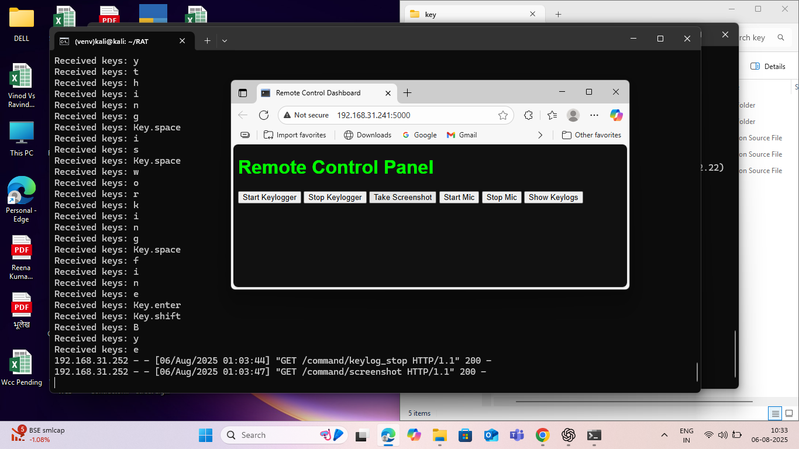
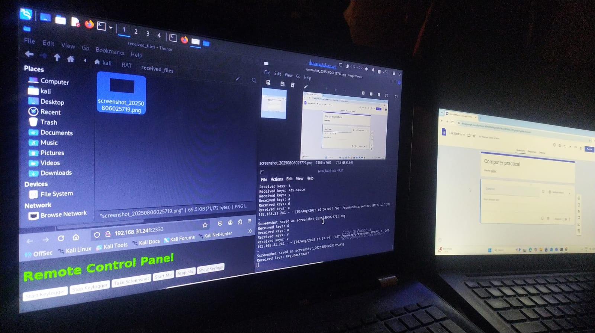

# KeyDash_V1

KeyDash_V1 is an educational project demonstrating a simple client-server architecture for remote administration and file transfer. The project consists of a RAT (Remote Administration Tool) server and a Victim client, allowing for basic communication and screenshot transfer.

## Features

- Remote screenshot capture and transfer
- Simple client-server communication
- Web interface for viewing received files

## Project Structure

```
RAT/
	server.py
	received_files/
		screenshot_YYYYMMDDHHMMSS.png
	templates/
		index.html
VICTIM/
	client.py
```

## Getting Started

1. **Clone the repository:**
	 ```powershell
	 git clone https://github.com/StickBoiz/KeyDash_V1.git
	 ```

2. **Run the server:**
	 ```powershell
	 cd KeyDash_V1/RAT
	 python server.py
	 ```

3. **Run the client:**
	 ```powershell
	 cd KeyDash_V1/VICTIM
	 python client.py
	 ```

## Screenshots




## YOU MUST BE IN SAME NETWORK UNLESS YOUR SERVER IP IS PUBLIC!!!
## Disclaimer

This project is for educational purposes only. Do not use it for unauthorized access or malicious activities.

## License

MIT License


